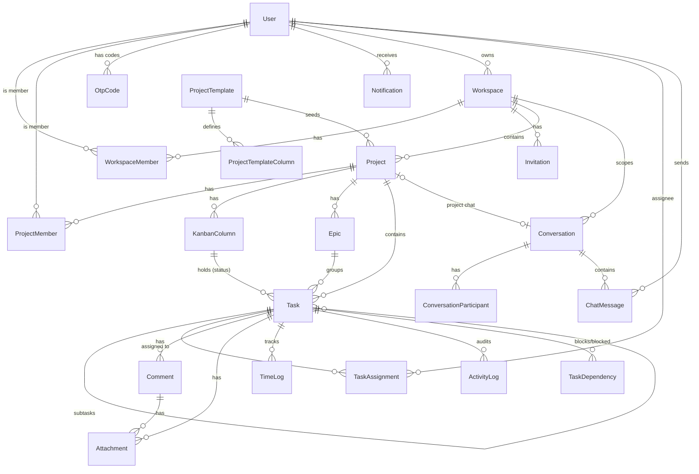

# Database Schema & Design

Quirk uses **PostgreSQL** accessed through the **Prisma ORM**. This document
describes the data model: entities, relationships, and the conventions that keep
the multi-tenant SaaS consistent and safe. The authoritative source is
[`backend/prisma/schema.prisma`](../backend/prisma/schema.prisma); this document
explains it.

## Conventions

- **Identifiers** — every entity's primary key is a UUID string
  (`@default(uuid())`), never an auto-increment integer. IDs are opaque and never
  numerically coerced. See [ADR 0001](./adr/0001-use-uuid-identifiers-end-to-end.md).
- **Tenancy** — `Workspace` is the tenant boundary. Projects, tasks, chat, and
  invitations all resolve to a workspace, and access is authorized at the object
  level ([ADR 0002](./adr/0002-workspace-tenancy-and-scoped-authorization.md)).
- **Roles are scoped, not global** — a user's role lives on the join row
  (`WorkspaceMember.role`, `ProjectMember.role`), so the same user can be an Admin
  in one workspace and a Collaborator in another. Platform-wide access is the
  separate `User.isPlatformAdmin` flag.
- **Soft deletes** — `User`, `Project`, `Task`, `Comment`, and `ChatMessage` carry
  a nullable `deletedAt`; rows are retained so history and audit trails are not
  disrupted. Queries filter on `deletedAt: null`.
- **Workflow state** — a task's status is its `columnId` (FK to `KanbanColumn`),
  not a duplicated status string ([ADR 0006](./adr/0006-kanban-column-as-task-workflow-state.md)).
- **Secrets at rest** — invitation tokens (`Invitation.tokenHash`) and one-time
  codes (`OtpCode.codeHash`) are stored only as hashes; the raw value is emailed
  and never persisted.
- **Timestamps** — `createdAt` (`@default(now())`) and `updatedAt` (`@updatedAt`)
  are standard across mutable models.

A class-diagram view of the same domain is in
[DIAGRAMS.md](./DIAGRAMS.md#1-domain-class-diagram).

## Entity-relationship diagram



## Models

### Identity & tenancy

| Model | Purpose | Key fields / notes |
| --- | --- | --- |
| **User** | A person who can sign in | `email` (unique), `passwordHash`, `role`, `isPlatformAdmin`, `mustResetPassword`, `isActive`, `emailVerified`, `twoFactorEnabled`, `tokenValidFrom` (session cutoff), soft-delete `deletedAt` |
| **Workspace** | Tenant boundary / organization | `ownerId` → User (Restrict); has members, projects, invitations, conversations |
| **WorkspaceMember** | Join: user ↔ workspace with a role | Composite PK `(workspaceId, userId)`; `role` = `Admin` \| `Project Manager` \| `Collaborator` (legacy `Owner` treated as Admin) |
| **Invitation** | Tokenized invite to a workspace | `tokenHash` (unique), `role`, `status` = `pending`/`accepted`/`revoked`, `expiresAt`; only the hash is stored |
| **OtpCode** | One-time codes for email verify / 2FA | `codeHash`, `purpose` = `EMAIL_VERIFY`/`LOGIN_2FA`, `expiresAt`, `attempts`, `consumedAt`; single-use & attempt-limited |

### Projects & workflow

| Model | Purpose | Key fields / notes |
| --- | --- | --- |
| **Project** | Work container in a workspace | `workspaceId` (SetNull), `createdBy` (Restrict), `status` = `active`/`archived`, optional `templateId`, soft-delete |
| **ProjectMember** | Join: user ↔ project with a role | Composite PK `(projectId, userId)`; `role` = `Project Manager` \| `Collaborator` |
| **KanbanColumn** | Dynamic workflow column | `projectId`, `order`; a task's column **is** its status |
| **Epic** | Group of related tasks | `projectId`, `name`, `color` |
| **ProjectTemplate** / **ProjectTemplateColumn** | Reusable starting column sets | Seed columns for new projects |

### Tasks & sub-resources

| Model | Purpose | Key fields / notes |
| --- | --- | --- |
| **Task** | Unit of work | `title` (required), `columnId` (status), `dueDate`, `priority` = `Low`/`Medium`/`High`/`Urgent`, `tags[]`, `epicId`, `estimatedHours`, `parentTaskId` (subtasks), soft-delete |
| **TaskAssignment** | Join: task ↔ assignee | Composite PK `(taskId, userId)` |
| **TaskDependency** | "Task A blocks Task B" | Unique `(blockingTaskId, blockedTaskId)` |
| **Comment** | Discussion on a task | `content`, soft-delete; may carry attachments |
| **Attachment** | Uploaded file on a task/comment | `blobUrl`, `originalName`, `mimeType`, `sizeBytes`; storage in Azure Blob (prod) or local disk (dev) |
| **TimeLog** | Logged hours on a task | `hours`, `date`, `note` |
| **ActivityLog** | Automated per-task audit trail | `action`, `metadata` (JSON) |

### Notifications & chat

| Model | Purpose | Key fields / notes |
| --- | --- | --- |
| **Notification** | Per-user notification | `recipientId`, `type` = `Assignment`/`ColumnChange`/`Comment`/`Deadline`/`Admin`, `isRead`, `relatedTaskId` |
| **Conversation** | Project group chat or DM thread | `type` = `PROJECT`/`DIRECT`, `projectId` (unique, for PROJECT), `workspaceId` |
| **ConversationParticipant** | Join: user ↔ conversation | Composite PK `(conversationId, userId)` |
| **ChatMessage** | A message in a conversation | `content`, soft-delete (content shown as `[deleted]`) |

## Referential integrity

Foreign-key delete behavior is chosen deliberately:

- **Cascade** — child rows that have no meaning without their parent (memberships,
  assignments, comments, attachments, time logs, activity logs, chat
  participants/messages, invitations).
- **Restrict** — authorship that must not be silently orphaned (`Workspace.owner`,
  `Project.creator`, `Task.creator`, `Comment.user`, `Attachment.uploader`,
  `ChatMessage.sender`). Deleting such a user is blocked; deactivation (soft) is
  used instead.
- **SetNull** — optional context that can outlive its reference
  (`Task.project`/`column`/`epic`, `Project.workspace`/`template`,
  `Notification.relatedTask`).

## Indexing

Hot query paths are indexed: foreign keys (`userId`, `projectId`, `taskId`,
`workspaceId`), tenant/status filters (`Invitation(workspaceId, status)`,
`Notification(recipientId, isRead)`), ordering (`KanbanColumn(projectId, order)`),
and time-ordered reads (`ActivityLog(taskId, createdAt)`,
`ChatMessage(conversationId, createdAt)`).

## Schema management

The schema is applied with **`npx prisma db push`** (no migration history is
checked in). In CI/CD the same command runs against Azure PostgreSQL before the
images deploy; `--accept-data-loss` is intentionally **not** used, so a
destructive divergence fails the deploy loudly rather than dropping data. See
[DEPLOYMENT.md](./DEPLOYMENT.md).

```bash
cd backend
npx prisma validate     # validate the schema
npx prisma db push      # sync the schema to DATABASE_URL
npx prisma studio       # optional: browse data
```
