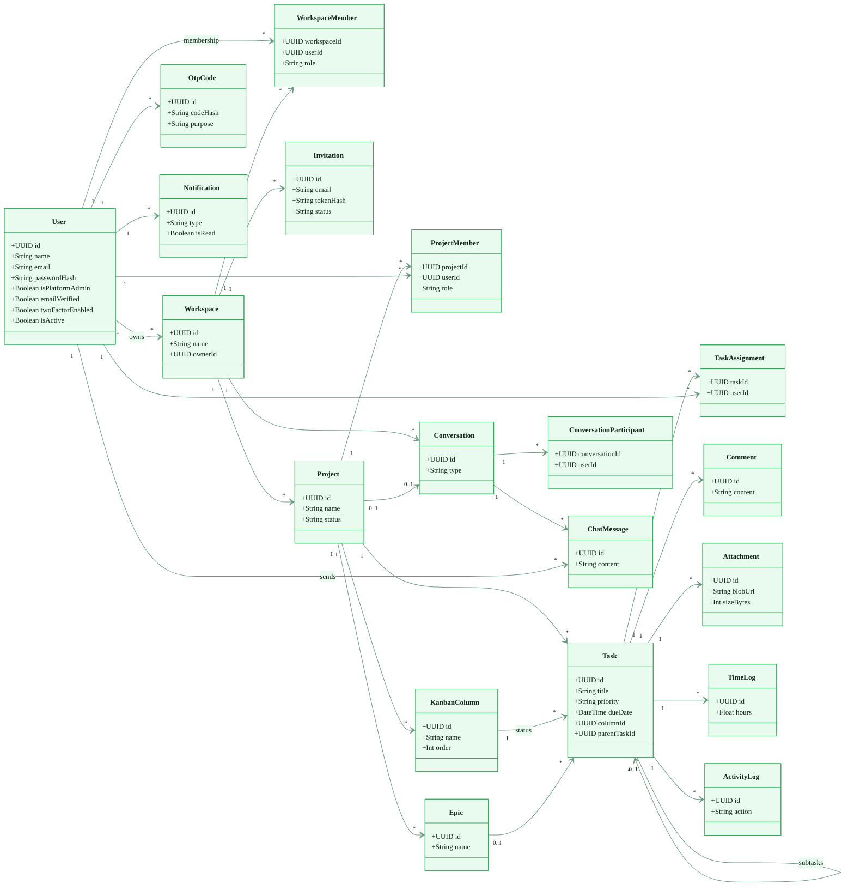
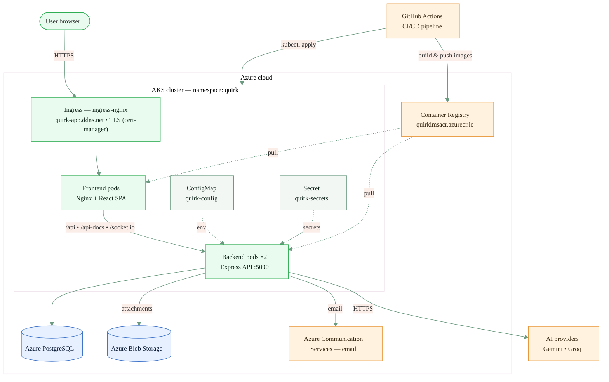
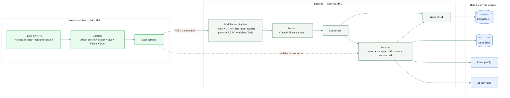
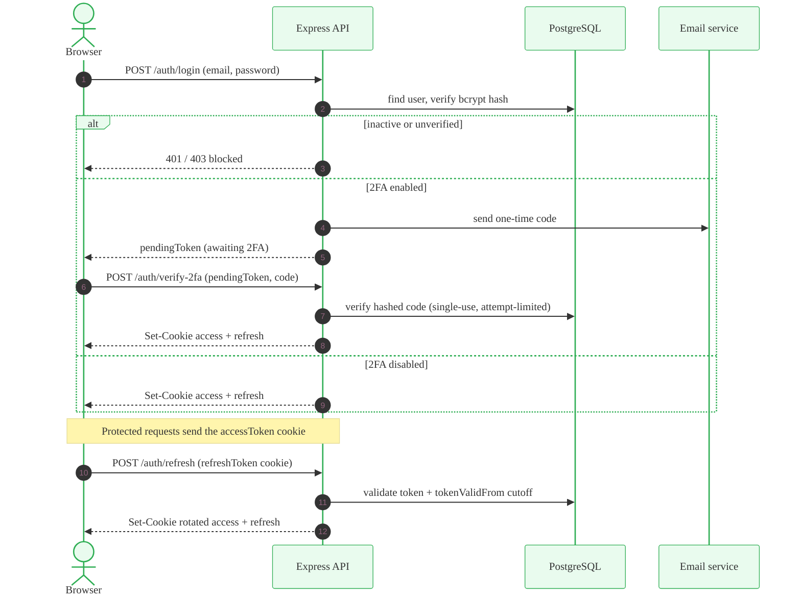
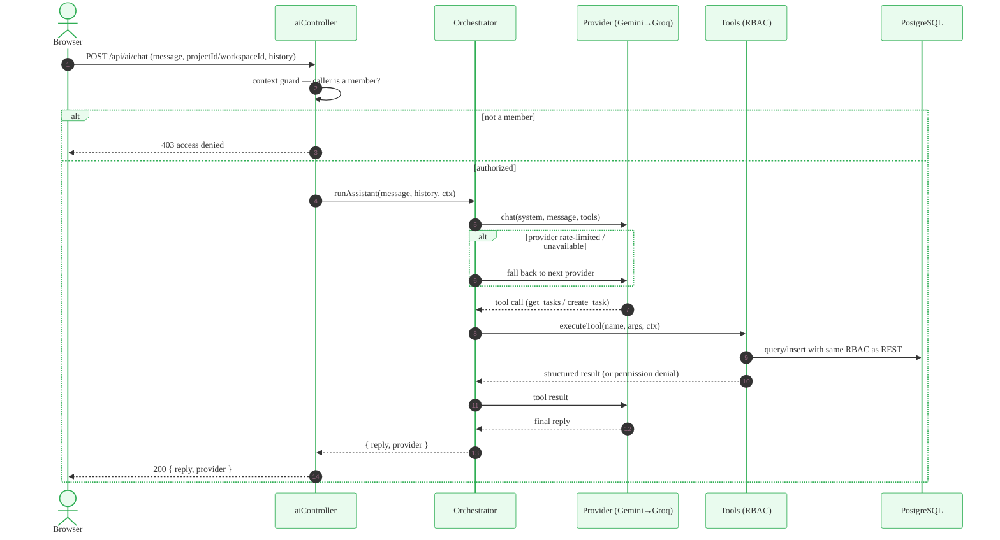
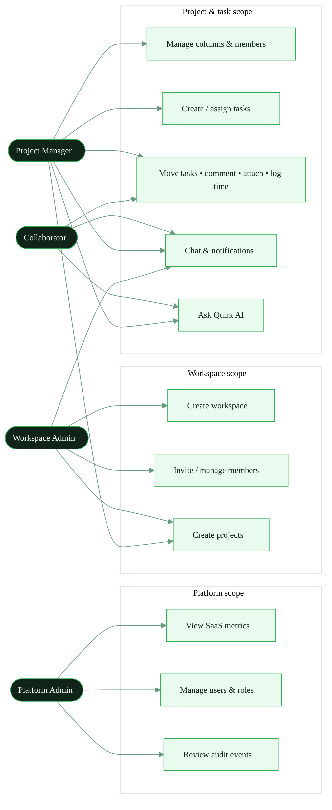
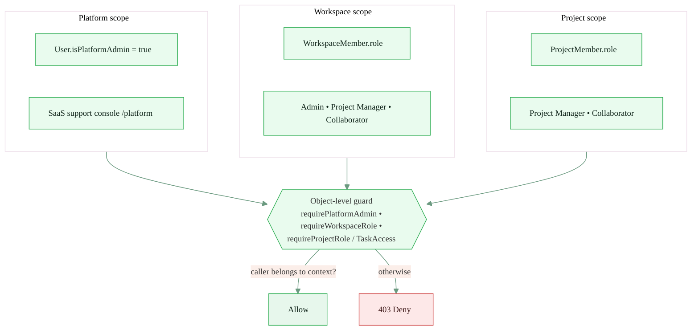
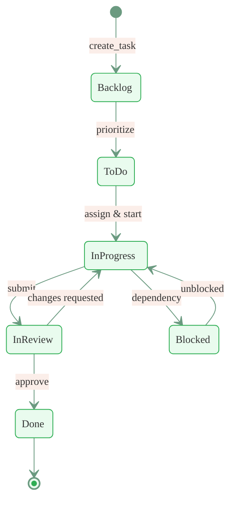

# Diagrams

Visual models of Quirk, written in [Mermaid](https://mermaid.js.org) so they render
directly on GitHub and stay versioned with the code. They are derived from the
actual schema, routes, and manifests.

**Contents**

1. [Domain class diagram](#1-domain-class-diagram)
2. [Deployment diagram](#2-deployment-diagram)
3. [System architecture / components](#3-system-architecture--components)
4. [Authentication sequence](#4-authentication-sequence)
5. [AI assistant request flow](#5-ai-assistant-request-flow)
6. [Use-case diagram](#6-use-case-diagram)
7. [Multi-tenant authorization scopes](#7-multi-tenant-authorization-scopes)
8. [Task lifecycle (Kanban workflow)](#8-task-lifecycle-kanban-workflow)

> An entity-relationship diagram focused on cardinality lives in
> [DATABASE.md](./DATABASE.md#entity-relationship-diagram).

---

## 1. Domain class diagram

The core domain model — entities, their key attributes, and associations with
multiplicity. Full field lists are in [DATABASE.md](./DATABASE.md).

---

## 2. Deployment diagram

Runtime topology on Azure: ingress + TLS, the AKS `quirk` namespace, and the
managed services the backend depends on. See [DEPLOYMENT.md](./DEPLOYMENT.md).

---

## 3. System architecture / components

The layered request path through the SPA and the Express MVC backend.

---

## 4. Authentication sequence

Login with optional email 2FA, then token rotation on refresh. Passwords are
bcrypt-hashed; tokens are HTTP-only cookies. See
[ADR 0003](./adr/0003-registration-email-verification-and-2fa.md).

---

## 5. AI assistant request flow

Provider fallback (Gemini → Groq) with RBAC-safe tool execution. The context guard
and every tool re-apply the same object-level authorization as the REST API. See
[ADR 0010](./adr/0010-ai-assistant-provider-fallback-and-tools.md).

---

## 6. Use-case diagram

Actors and the main use cases by authorization scope.

---

## 7. Multi-tenant authorization scopes

Three independent scopes; access is always checked at the object level, not by role
alone. See [ADR 0002](./adr/0002-workspace-tenancy-and-scoped-authorization.md) and
[ADR 0008](./adr/0008-platform-admin-and-srs-tenant-roles.md).

---

## 8. Task lifecycle (Kanban workflow)

Columns are dynamic per project; a task's status **is** its `columnId`. The states
below illustrate a typical default board ([ADR 0006](./adr/0006-kanban-column-as-task-workflow-state.md)).

